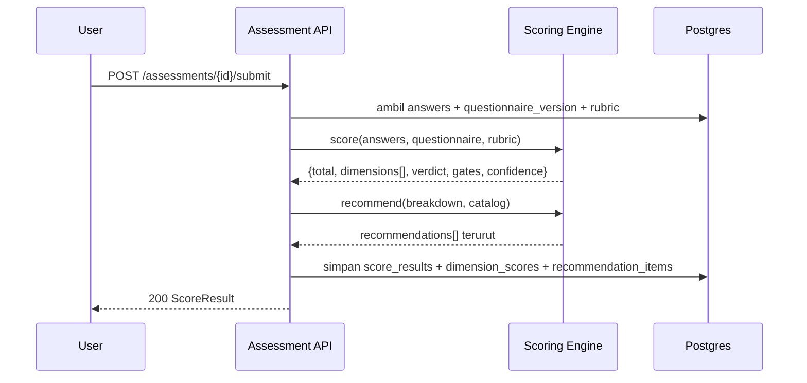
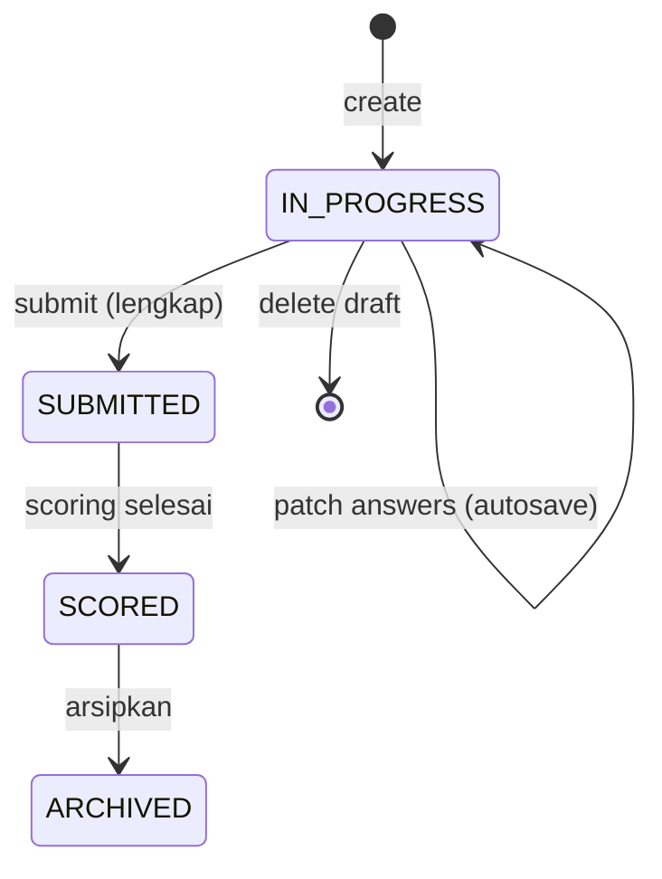

# DESIGN.md — Desain Sistem & Antarmuka
**Produk:** SiapAI · **Versi:** 1.0 · **Tanggal:** 2026-09-12

---

## Bagian A — Desain Sistem

### A1. Keputusan Arsitektur (ADR ringkas)
| ADR | Keputusan | Alternatif ditolak | Alasan |
|---|---|---|---|
| ADR-001 | Modular monolith NestJS | Microservices | Tim kecil, domain belum stabil |
| ADR-002 | Skoring sebagai paket murni terisolasi | Logika di service/DB | Determinisme & testability (BA2) |
| ADR-003 | Konten kuesioner di DB, berversi | Hardcode di kode | Konten berubah lebih cepat dari kode |
| ADR-004 | Snapshot hasil skoring (JSONB) | Hitung ulang saat render | Laporan historis harus stabil (PA4) |
| ADR-005 | PDF via render halaman hasil (Playwright) | Template PDF terpisah | Cegah drift HTML vs PDF (PA3) |
| ADR-006 | OpenAPI sebagai sumber kebenaran | Tipe manual | Sinkron FE/BE, uji kontrak otomatis |

### A2. Mesin Skoring — alur


### A3. State machine assessment


### A4. Strategi autosave & konflik
- Klien mengirim batch `PATCH` dengan `client_revision` naik monoton.
- Server menerapkan last-write-wins per `question_code` dan mengembalikan `server_revision`.
- Bila `server_revision` lebih besar dari yang diketahui klien (tab lain), klien refetch dan menampilkan banner "jawaban diperbarui dari sesi lain".
- Offline: antrean di IndexedDB, flush saat online.

### A5. Model konten
Satu `questionnaire_version` memuat dimensi, pertanyaan, opsi, bobot, aturan visibilitas, dan pemetaan rekomendasi. `PUBLISHED` bersifat immutable. Assessment mengunci versi saat dibuat.

---

## Bagian B — Desain Antarmuka

### B1. Prinsip
1. **Satu pertanyaan, satu keputusan** — hindari dinding formulir.
2. **Selalu tunjukkan kemajuan** — pengguna tahu sisa waktu.
3. **Bahasa manusia** — hindari jargon; sediakan contoh konkret di help text.
4. **Tidak ada jalan buntu** — skor rendah selalu disertai langkah berikutnya.
5. **Aksesibel** — WCAG 2.1 AA, navigasi keyboard penuh, kontras ≥ 4.5:1.

### B2. Design token
```
Warna
  brand-900 #0B2E4F   brand-600 #1467B3   brand-300 #7FB3E3
  ok   #1B9E5A    warn #E8A317    danger #D64545    neutral-900 #111827
  bg   #F7F9FC    surface #FFFFFF   border #E3E8EF
Level maturitas: L1 #D64545 · L2 #E8734A · L3 #E8A317 · L4 #7BB661 · L5 #1B9E5A
Tipografi  Inter; H1 32/40 semibold · H2 24/32 · Body 16/26 · Caption 13/18
Spasi      skala 4px (4,8,12,16,24,32,48,64)
Radius     8px kartu, 6px input, 999px pill
Bayangan   sm 0 1px 2px rgba(16,24,40,.06) · md 0 4px 12px rgba(16,24,40,.08)
Breakpoint sm 640 · md 768 · lg 1024 · xl 1280
```

### B3. Peta layar
| Layar | Rute | Isi utama |
|---|---|---|
| Landing | `/` | Proposisi nilai, CTA Quick Check |
| Quick Check | `/quick` | 15 pertanyaan, satu per layar |
| Hasil ringkas | `/quick/result` | Skor total, CTA daftar |
| Onboarding org | `/onboarding` | Profil organisasi |
| Dashboard | `/app` | Kartu skor terakhir, tombol assessment baru, tren |
| Assessment | `/app/assessments/{id}` | Form per dimensi, sidebar progres |
| Review | `/app/assessments/{id}/review` | Daftar jawaban + yang kosong |
| Hasil | `/app/assessments/{id}/result` | Radar, dimensi, rekomendasi, roadmap |
| Riwayat | `/app/history` | Tabel + grafik tren |
| Anggota | `/app/settings/members` | RBAC |
| Admin CMS | `/admin/questionnaires` | Kelola konten |

### B4. Tata letak layar assessment
```
┌──────────────────────────────────────────────────────────────┐
│  SiapAI          Assessment Kesiapan AI        Tersimpan ✓   │
├───────────────┬──────────────────────────────────────────────┤
│ PROGRES 42%   │  Dimensi 2 dari 7 — DATA                     │
│ ● Strategi  ✓ │                                              │
│ ◐ Data        │  Pertanyaan 3 dari 8                         │
│ ○ Teknologi   │  ─────────────────────────────────────────   │
│ ○ SDM         │  Seberapa mudah tim Anda mengakses data      │
│ ○ Proses      │  operasional untuk analisis?                 │
│ ○ Tata Kelola │                                              │
│ ○ Finansial   │  ( ) Harus minta manual ke IT, berhari-hari  │
│               │  ( ) Ada ekspor berkala mingguan/bulanan     │
│ ⏱ ±14 menit   │  (•) Ada dashboard self-service              │
│               │  ( ) Ada akses API/warehouse terdokumentasi  │
│               │  ( ) Real-time, bertata kelola, self-service │
│               │                                              │
│               │  ⓘ Contoh: jika analis harus WA staf IT      │
│               │    untuk minta ekspor, pilih opsi pertama.   │
│               │                                              │
│               │  [ Lampirkan bukti (opsional) ]              │
│               │                        [ Kembali ] [ Lanjut ]│
└───────────────┴──────────────────────────────────────────────┘
```

### B5. Tata letak halaman hasil
```
┌──────────────────────────────────────────────────────────────┐
│  VERDICT: CONDITIONALLY READY            Skor 58.4 / 100     │
│  Level 3 — Defined            Keyakinan: Sedang              │
│  ⚠ Gate: Fondasi data Anda (36.0) di bawah ambang 40         │
├───────────────────────────────┬──────────────────────────────┤
│        [ RADAR 7 DIMENSI ]    │  Strategi      72  L4  ▰▰▰▰  │
│                               │  Data          36  L2  ▰▰    │
│      Anda ── Median industri  │  Teknologi     61  L4  ▰▰▰▰  │
│                               │  SDM           48  L3  ▰▰▰   │
│  Persentil industri: ke-62    │  Proses        55  L3  ▰▰▰   │
│  (n=141, Retail, 50–99)       │  Tata Kelola   40  L3  ▰▰▰   │
│                               │  Finansial     66  L4  ▰▰▰▰  │
├───────────────────────────────┴──────────────────────────────┤
│  3 LANGKAH PRIORITAS                                         │
│  1. Bangun katalog data & satu sumber kebenaran  Dampak 5/5  │
│     Usaha 2/5 · 0–3 bln · Owner: Head of IT · Rp 10–30 jt    │
│  2. Tetapkan kebijakan penggunaan AI & PDP       Dampak 4/5  │
│  3. Latih 5 champion data di tiap divisi         Dampak 4/5  │
├──────────────────────────────────────────────────────────────┤
│  ROADMAP   [0–3 bln] [3–6 bln] [6–12 bln]                    │
│  [ Unduh PDF ]  [ Bagikan tautan ]  [ Jadwalkan ukur ulang ] │
└──────────────────────────────────────────────────────────────┘
```

### B6. Komponen kunci
| Komponen | Perilaku |
|---|---|
| `QuestionCard` | Satu pertanyaan, opsi radio besar (target sentuh ≥ 44px), help text dapat dibuka, autofokus |
| `ProgressSidebar` | Status per dimensi, klik untuk lompat, estimasi waktu tersisa |
| `SaveIndicator` | `Menyimpan… / Tersimpan ✓ / Gagal — coba lagi` |
| `RadarChart` | Skor pengguna vs median industri; aria-label berisi nilai numerik |
| `ScoreBar` | Warna mengikuti level, selalu disertai angka (bukan warna saja) |
| `RecommendationCard` | Judul, dampak/usaha, horizon, owner, estimasi biaya, aksi "tandai dikerjakan" |
| `EmptyState` | Ilustrasi + satu CTA jelas |

### B7. Status & penanganan kesalahan di UI
| Status | Perilaku |
|---|---|
| Loading | Skeleton, bukan spinner penuh layar |
| Autosave gagal | Banner kuning persisten + tombol coba lagi; data disimpan lokal |
| Submit tidak lengkap | Daftar pertanyaan kurang, klik untuk melompat ke pertanyaan |
| Benchmark tidak tersedia | Sembunyikan persentil, tampilkan "Data pembanding belum cukup" |
| Terkunci paywall | Blur hasil detail + kartu penjelasan nilai, bukan dinding keras |

### B8. Aksesibilitas & konten
- Setiap input punya `<label>`; grup radio memakai `fieldset/legend`.
- Fokus terlihat, urutan tab logis, pengumuman `aria-live` saat autosave & error.
- Bahasa Indonesia formal-ramah; hindari "leverage", "synergy"; jelaskan istilah teknis pada help text.

### B9. Kinerja frontend
Target LCP < 2.5 s pada 4G, JS awal < 180 KB gzip, chart di-lazy load, halaman pertanyaan diprefetch satu langkah ke depan.
