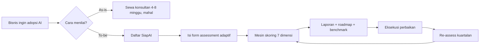

# BRD — Business Requirements Document
**Produk:** SiapAI — Aplikasi Audit Kesiapan AI untuk Bisnis
**Versi:** 1.0 · **Status:** Draft for approval · **Tanggal:** 2026-09-12

---

## 1. Ringkasan Eksekutif
Banyak perusahaan ingin mengadopsi AI tetapi tidak tahu apakah organisasinya sudah siap. Keputusan diambil berdasarkan hype, bukan bukti. Akibatnya proyek AI mahal gagal di tahap pilot (industry benchmark: ~70–80% pilot tidak naik ke produksi).

SiapAI adalah aplikasi audit berbasis web yang memandu bisnis mengisi **form assessment terstruktur**, menghitung **skor kesiapan AI** pada 7 dimensi, dan menghasilkan **laporan + roadmap rekomendasi** yang dapat ditindaklanjuti.

## 2. Masalah Bisnis
| # | Masalah | Dampak |
|---|---|---|
| P1 | Tidak ada baseline objektif kesiapan AI | Investasi salah sasaran |
| P2 | Data & infrastruktur belum siap tapi tidak diketahui | Proyek mandek di integrasi |
| P3 | Konsultan manual mahal (Rp 50–500 jt) dan lambat (4–8 minggu) | UMKM/mid-market tidak terlayani |
| P4 | Hasil audit tidak terukur ulang | Tidak ada bukti progres kuartalan |

## 3. Tujuan Bisnis & Metrik Sukses
| ID | Tujuan | KPI | Target 6 bulan |
|---|---|---|---|
| G1 | Menyediakan audit mandiri < 30 menit | Median waktu penyelesaian | ≤ 25 menit |
| G2 | Menghasilkan laporan yang dipercaya | % user unduh/ bagikan laporan | ≥ 60% |
| G3 | Monetisasi | Konversi free → paid report | ≥ 8% |
| G4 | Retensi pengukuran ulang | % org re-assess dalam 6 bln | ≥ 25% |
| G5 | Kualitas rekomendasi | CSAT laporan | ≥ 4.2 / 5 |

## 4. Ruang Lingkup
**In scope (v1)**
- Registrasi organisasi & user, multi-tenant.
- Form assessment adaptif 7 dimensi (~60 pertanyaan, branching by industri & ukuran).
- Mesin skoring berbobot + level maturitas 1–5.
- Laporan HTML/PDF: skor, benchmark industri, gap analysis, roadmap 0–3–12 bulan.
- Dashboard riwayat assessment & tren.
- Ekspor data (CSV/JSON), share link read-only.

**Out of scope (v1)**
- Integrasi otomatis ke sistem klien (ERP/CRM/data warehouse).
- Marketplace vendor / matchmaking konsultan.
- Penilaian keamanan teknis mendalam (pentest).
- Mobile native app (web responsif saja).

## 5. Stakeholder
| Peran | Kepentingan |
|---|---|
| Owner/CEO UMKM–mid market | Tahu siap atau belum, biaya rendah |
| CTO / Head of IT | Gap teknis & data |
| Konsultan / Partner | Alat standar untuk klien mereka |
| Internal Product & Ops | Konten pertanyaan, kualitas rekomendasi |
| Compliance | Perlindungan data (UU PDP No. 27/2022) |

## 6. Proses Bisnis (as-is → to-be)

## 7. Model Bisnis
| Tier | Harga | Isi |
|---|---|---|
| Free | Rp 0 | Quick check 15 pertanyaan, skor total saja |
| Pro | Rp 1.5 jt / assessment | Full 7 dimensi, PDF, roadmap, benchmark |
| Team | Rp 12 jt / tahun | Multi-user, re-assess unlimited, tren, ekspor |
| Partner | Custom | White-label untuk konsultan |

## 8. Asumsi
- Responden jujur; audit bersifat self-declared (v1 tidak memverifikasi bukti).
- Benchmark awal disusun dari data publik + seed data internal, di-refresh tiap kuartal.
- Bahasa utama Indonesia, English menyusul.

## 9. Risiko
| Risiko | Dampak | Mitigasi |
|---|---|---|
| Bias self-report | Skor terlalu optimis | Pertanyaan berbasis bukti/perilaku, bukan opini; evidence upload opsional |
| Kualitas rekomendasi dangkal | Churn | Rule engine + review pakar, versi konten terkontrol |
| Data sensitif bisnis bocor | Legal & reputasi | Enkripsi at-rest/in-transit, RBAC, retensi terbatas, kepatuhan UU PDP |
| Form terlalu panjang | Drop-off | Adaptif + simpan otomatis + resume |

## 10. Kriteria Penerimaan Bisnis
- BA1: Pengguna baru dapat menyelesaikan assessment penuh dan menerima laporan tanpa bantuan manusia.
- BA2: Skor deterministik: input sama → skor sama (reproducible, versi rubric tercatat).
- BA3: Laporan memuat minimal 3 rekomendasi prioritas dengan estimasi effort dan dampak.
- BA4: Drop-off rate form < 35%.
