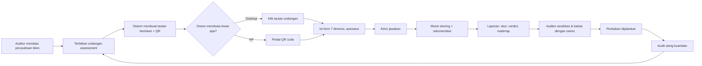

# BRD — Business Requirements Document
**Produk:** SiapAI — Aplikasi Audit Kesiapan AI untuk Bisnis
**Versi:** 2.0 · **Status:** Draft for approval · **Tanggal:** 2026-09-12

> **Perubahan dari v1.0:** model bisnis self-serve dengan tier gratis dibatalkan.
> SiapAI kini berbasis **undangan**: auditor menerbitkan satu form assessment untuk
> owner perusahaan, owner mengisinya (lewat tautan atau **pindai QR di HP**), lalu
> laporan kesiapan diterbitkan. Tidak ada tier gratis, tidak ada paywall, dan tidak
> ada penjualan mandiri di dalam aplikasi.

---

## 1. Ringkasan Eksekutif
Banyak perusahaan ingin mengadopsi AI tetapi tidak tahu apakah organisasinya sudah siap. Keputusan diambil berdasarkan hype, bukan bukti, sehingga proyek mahal berhenti di tahap pilot.

SiapAI adalah alat audit berbasis undangan. Auditor (tim internal atau konsultan mitra) menerbitkan **form assessment** untuk sebuah perusahaan. Owner atau pimpinan perusahaan tersebut membuka form melalui tautan undangan atau memindai **QR code**, mengisi pertanyaan penentu kesiapan, dan sistem menghasilkan **skor 7 dimensi, verdict siap/belum, serta roadmap rekomendasi**.

## 2. Masalah Bisnis
| # | Masalah | Dampak |
|---|---|---|
| P1 | Tidak ada baseline objektif kesiapan AI | Investasi salah sasaran |
| P2 | Data & infrastruktur belum siap tapi tidak diketahui | Proyek mandek di integrasi |
| P3 | Audit manual lambat dan tidak terstandar antar konsultan | Hasil tidak dapat dibandingkan |
| P4 | Owner sering tidak di depan laptop | Form desktop-only tidak pernah selesai diisi |
| P5 | Hasil audit tidak terukur ulang | Tidak ada bukti progres kuartalan |

## 3. Tujuan Bisnis & Metrik Sukses
| ID | Tujuan | KPI | Target 6 bulan |
|---|---|---|---|
| G1 | Owner dapat menyelesaikan form tanpa pendampingan | Median waktu penyelesaian | ≤ 25 menit |
| G2 | Undangan benar-benar diselesaikan | % undangan terkirim yang berstatus selesai | ≥ 70% |
| G3 | Pengisian lewat HP berjalan mulus | % penyelesaian dari perangkat mobile | ≥ 40% |
| G4 | Laporan dipercaya dan dipakai | % laporan diunduh atau dibagikan | ≥ 60% |
| G5 | Pengukuran ulang | % perusahaan diaudit ulang dalam 6 bulan | ≥ 25% |
| G6 | Kualitas rekomendasi | CSAT laporan | ≥ 4.2 / 5 |

## 4. Ruang Lingkup
**In scope (v2)**
- Auditor membuat profil perusahaan klien dan **menerbitkan undangan form**.
- **Tautan undangan bertoken** dan **QR code** yang dapat dicetak atau dikirim.
- Owner mengisi form tanpa perlu membuat akun; identitas dibuktikan oleh token undangan.
- Form responsif mobile-first, satu pertanyaan per layar, autosave, dapat dilanjutkan.
- Mesin skoring 7 dimensi, hard gate, verdict, level maturitas.
- Laporan: skor, gap analysis, rekomendasi berprioritas, roadmap 3 horizon.
- Ekspor PDF dan tautan bagikan read-only.
- Dashboard auditor: status semua undangan, riwayat, dan tren per perusahaan.

**Out of scope (v2)**
- Tier gratis, quick check publik, checkout mandiri, dan paywall. **Dihapus dari produk.**
- Integrasi otomatis ke sistem klien (ERP/CRM/warehouse).
- Marketplace vendor atau matchmaking konsultan.
- Penilaian keamanan teknis mendalam (pentest).
- Aplikasi mobile native; cukup web responsif yang dibuka dari QR.

## 5. Stakeholder
| Peran | Kepentingan |
|---|---|
| **Auditor** (tim internal / konsultan mitra) | Menerbitkan undangan, memantau pengisian, menyerahkan laporan |
| **Owner / pimpinan perusahaan** (responden) | Mengisi form dengan cepat, termasuk dari HP; menerima jawaban siap atau belum |
| **Head of IT klien** | Menjawab bagian data dan teknologi; melihat gap teknis |
| Internal Product & Ops | Menjaga kualitas bank pertanyaan dan rekomendasi |
| Compliance | Perlindungan data responden (UU PDP No. 27/2022) |

## 6. Proses Bisnis (as-is → to-be)

## 7. Model Komersial
Tidak ada penjualan mandiri di dalam aplikasi. Aplikasi adalah alat kerja auditor; komersial diatur di luar sistem lewat kontrak layanan audit atau lisensi mitra. Konsekuensinya:
- Tidak ada modul pembayaran, tidak ada entitlement, tidak ada paywall.
- Seluruh isi laporan terbuka penuh bagi perusahaan yang diaudit.
- Pembatasan kuota, bila kelak diperlukan, diatur pada level akun auditor, bukan dengan mengunci fitur dari responden.

## 8. Asumsi
- Owner bersedia mengisi sendiri; jawaban bersifat self-declared dan v2 tidak memverifikasi bukti secara wajib.
- Satu undangan ditujukan untuk satu perusahaan dan satu siklus audit.
- Owner dapat mendelegasikan sebagian pertanyaan teknis kepada stafnya lewat tautan yang sama.
- Bahasa utama Indonesia.

## 9. Risiko
| Risiko | Dampak | Mitigasi |
|---|---|---|
| Tautan undangan bocor ke pihak lain | Data perusahaan terekspos | Token acak panjang, masa berlaku terbatas, dapat dicabut, tidak terindeks mesin pencari |
| Bias self-report | Skor terlalu optimis | Pertanyaan berbasis perilaku dan bukti, bukan opini; unggah bukti opsional menaikkan confidence |
| Owner berhenti di tengah | Undangan tidak selesai | Autosave, dapat dilanjutkan, pengingat otomatis, QR agar bisa lanjut di HP |
| Form terasa panjang di layar kecil | Drop-off tinggi | Mobile-first, satu pertanyaan per layar, indikator sisa waktu |
| Data sensitif bisnis bocor | Legal dan reputasi | Enkripsi at-rest/in-transit, RBAC, retensi terbatas, kepatuhan UU PDP |

## 10. Kriteria Penerimaan Bisnis
- **BA1**: Auditor dapat menerbitkan undangan dan memperoleh tautan sekaligus QR code yang siap dibagikan.
- **BA2**: Owner dapat menyelesaikan seluruh form dari HP dengan memindai QR, tanpa membuat akun.
- **BA3**: Skor deterministik: input sama menghasilkan skor sama, dengan versi rubrik tercatat.
- **BA4**: Laporan memuat minimal 3 rekomendasi prioritas dengan estimasi dampak dan usaha.
- **BA5**: Pengisian dapat ditinggal dan dilanjutkan di perangkat berbeda tanpa kehilangan jawaban.
- **BA6**: Tidak ada satu pun bagian laporan yang terkunci di balik pembayaran.
