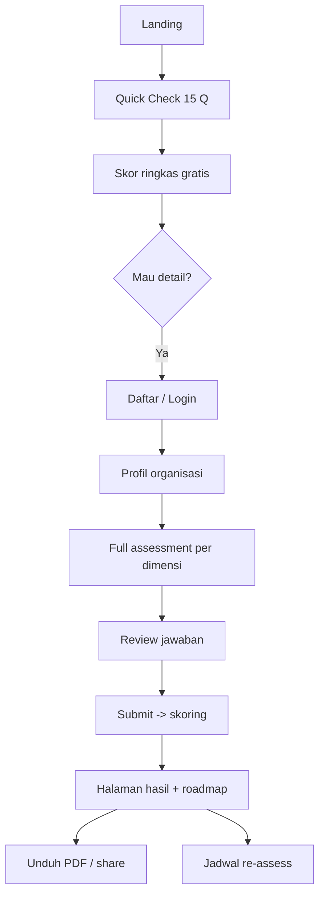

# PRD — Product Requirements Document
**Produk:** SiapAI · **Versi:** 1.0 · **Tanggal:** 2026-09-12
**Owner:** Product · **Terkait:** BRD.md, FRD.md, TRD.md, DESIGN.md, contracts/openapi.yaml

---

## 1. Visi Produk
> Menjadikan "apakah bisnis saya siap AI?" sebuah pertanyaan yang bisa dijawab dalam 25 menit dengan bukti, bukan opini.

## 2. Persona
| Persona | Konteks | Kebutuhan | Rasa sakit |
|---|---|---|---|
| **Budi — Owner UMKM (30–100 karyawan)** | Non-teknis, dengar AI dari LinkedIn | Jawaban sederhana: siap/belum, mulai dari mana | Takut buang uang |
| **Sari — Head of IT mid-market** | Punya tim 5–15 | Gap teknis konkret & roadmap | Manajemen minta "pakai AI" tanpa arah |
| **Dimas — Konsultan** | Melayani 10+ klien | Alat standar, laporan white-label | Bikin deck manual tiap klien |
| **Admin internal** | Tim konten | Kelola bank pertanyaan & rubrik | Konten hardcoded |

## 3. Jobs To Be Done
- JTBD1: Ketika saya mempertimbangkan investasi AI, saya ingin ukuran objektif kesiapan, agar tidak salah alokasi anggaran.
- JTBD2: Ketika saya tahu skor saya rendah, saya ingin tahu langkah konkret berurutan, agar bisa memperbaiki.
- JTBD3: Ketika saya sudah memperbaiki, saya ingin mengukur ulang, agar bisa membuktikan progres ke atasan.

## 4. Model Kesiapan — 7 Dimensi
| Kode | Dimensi | Bobot default | Yang diukur |
|---|---|---|---|
| STR | Strategi & Kepemimpinan | 15% | Sponsorship, use case terdefinisi, anggaran |
| DAT | Data | 25% | Ketersediaan, kualitas, tata kelola, akses |
| TEC | Teknologi & Infrastruktur | 15% | Cloud, API, integrasi, MLOps |
| PPL | SDM & Keterampilan | 15% | Talenta, literasi, budaya eksperimen |
| PRC | Proses & Operasi | 10% | Dokumentasi proses, standarisasi, otomasi |
| GOV | Tata Kelola, Risiko, Kepatuhan | 10% | Kebijakan AI, PDP, audit trail, etika |
| FIN | Finansial & Nilai | 10% | ROI framework, kesediaan investasi, ukuran dampak |

**Skala maturitas (level 1–5):** 1 Ad-hoc · 2 Emerging · 3 Defined · 4 Managed · 5 Optimized.

## 5. Fitur & Prioritas (MoSCoW)
| ID | Fitur | Prioritas | Catatan |
|---|---|---|---|
| F01 | Sign up / login (email + OTP, Google) | Must | |
| F02 | Profil organisasi (industri, ukuran, omzet, lokasi) | Must | Menentukan branching & benchmark |
| F03 | Quick Check 15 pertanyaan (free) | Must | Funnel utama |
| F04 | Full Assessment adaptif 7 dimensi | Must | Autosave tiap 5 detik |
| F05 | Progress bar + resume | Must | |
| F06 | Mesin skoring berbobot + versi rubrik | Must | Deterministik |
| F07 | Halaman hasil: radar chart, skor per dimensi, level | Must | |
| F08 | Gap analysis + rekomendasi berprioritas | Must | Impact × Effort |
| F09 | Roadmap 0–3 bln / 3–6 bln / 6–12 bln | Must | |
| F10 | Benchmark industri (percentile) | Should | Butuh ≥ 30 sampel/industri |
| F11 | Ekspor PDF & share link read-only | Must | |
| F12 | Riwayat & tren antar assessment | Should | |
| F13 | Multi-user per organisasi (RBAC) | Should | owner/admin/member/viewer |
| F14 | Admin CMS bank pertanyaan & rubrik | Should | Versioned |
| F15 | Upload bukti (opsional) per pertanyaan | Could | Naikkan confidence score |
| F16 | White-label partner | Could | v1.1 |
| F17 | Pembayaran (Midtrans/Xendit) | Should | Tier Pro |
| F18 | Notifikasi email hasil & reminder re-assess | Should | |

## 6. Alur Pengguna Utama


## 7. Struktur Form (ringkas)
- **Section 0 — Profil:** nama perusahaan, industri (enum), jumlah karyawan (band), omzet tahunan (band), lokasi, peran responden.
- **Section 1–7:** tiap dimensi 6–10 pertanyaan.
- **Tipe pertanyaan:** `single_choice` (skala maturitas 5 opsi), `multi_choice`, `scale_1_5`, `boolean`, `number`, `text` (opsional, tidak diskor).
- **Branching:** contoh — jika `TEC-01 = on-premise only` maka tampilkan `TEC-04 rencana migrasi cloud`; jika karyawan < 50 maka lewati `PPL-07 struktur tim data khusus`.
- **Validasi:** semua pertanyaan berskor wajib; teks opsional maks 1000 karakter.
- Bank pertanyaan lengkap: `docs/QUESTION_BANK.md`.

## 8. Aturan Skoring (ringkas, detail di FRD §5)
```
skor_pertanyaan   = nilai_opsi (0..100)
skor_dimensi      = Σ(skor_pertanyaan × bobot_pertanyaan) / Σ(bobot_pertanyaan)
skor_total        = Σ(skor_dimensi × bobot_dimensi)
level             = 1: <20 · 2: 20–39 · 3: 40–59 · 4: 60–79 · 5: ≥80
verdict           = READY ≥70 · CONDITIONALLY_READY 50–69 · NOT_READY <50
gate              : jika skor DAT < 40 maka verdict maksimal NOT_READY (data adalah prasyarat keras)
```

## 9. Non-Goals v1
Tidak memberi nasihat hukum, tidak menjanjikan angka ROI pasti, tidak mengakses sistem klien.

## 10. Rilis
| Milestone | Isi | Target |
|---|---|---|
| M1 Alpha | F01–F09, F11 | Minggu 6 |
| M2 Beta | F10, F12, F13, F18 | Minggu 10 |
| M3 GA | F14, F17, hardening, benchmark real | Minggu 14 |

## 11. Analitik yang Dilacak
`assessment_started`, `section_completed`, `question_answered`, `assessment_submitted`, `report_viewed`, `report_exported`, `reassess_scheduled`, `checkout_completed`, drop-off per pertanyaan.

## 12. Kriteria Penerimaan Produk
- PA1: Quick Check selesai ≤ 5 menit dan menghasilkan skor.
- PA2: Full assessment dapat ditinggal dan dilanjutkan di perangkat lain tanpa kehilangan jawaban.
- PA3: Laporan PDF identik isinya dengan halaman hasil.
- PA4: Rubrik yang dipakai tercatat pada tiap assessment (`rubric_version`) sehingga skor lama tidak berubah saat rubrik diperbarui.
