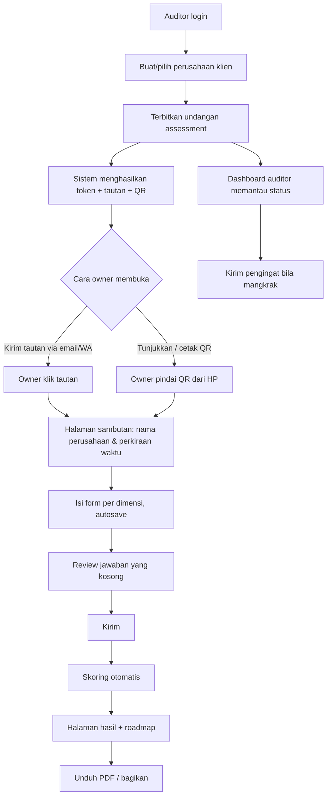

# PRD — Product Requirements Document
**Produk:** SiapAI · **Versi:** 2.0 · **Tanggal:** 2026-09-12
**Owner:** Product · **Terkait:** BRD.md, FRD.md, TRD.md, DESIGN.md, contracts/openapi.yaml

> **Perubahan dari v1.0:** tier gratis, Quick Check publik, paywall, dan checkout
> dihapus. Produk kini berbasis undangan: auditor menerbitkan form untuk owner,
> owner mengisi lewat tautan atau QR code di HP.

---

## 1. Visi Produk
> Menjadikan "apakah bisnis saya siap AI?" sebuah pertanyaan yang bisa dijawab dalam 25 menit oleh owner sendiri, dari HP-nya, dengan bukti dan bukan opini.

## 2. Persona
| Persona | Konteks | Kebutuhan | Rasa sakit |
|---|---|---|---|
| **Dimas — Auditor / konsultan** | Menangani banyak klien | Terbitkan form, pantau siapa sudah mengisi, serahkan laporan standar | Membuat deck manual tiap klien |
| **Budi — Owner perusahaan (responden)** | Non-teknis, sering di lapangan, pegang HP | Isi form cepat tanpa bikin akun, tahu siap atau belum | Form panjang di laptop tidak pernah dibuka |
| **Sari — Head of IT klien** | Diminta owner mengisi bagian teknis | Menjawab bagian data & teknologi lewat tautan yang sama | Ditanya hal yang tidak ia kuasai |
| **Admin konten internal** | Tim produk | Kelola bank pertanyaan & rubrik berversi | Konten hardcoded |

## 3. Jobs To Be Done
- JTBD1: Ketika auditor memulai engagement, ia ingin mengirim satu form standar, agar hasil antar klien dapat dibandingkan.
- JTBD2: Ketika owner menerima undangan, ia ingin langsung mengisi dari HP, agar tidak menunda sampai kembali ke kantor.
- JTBD3: Ketika hasil keluar, owner ingin tahu langkah konkret berurutan, agar bisa memperbaiki.
- JTBD4: Ketika perbaikan sudah dijalankan, auditor ingin mengukur ulang, agar progres terbukti.

## 4. Model Kesiapan — 7 Dimensi
| Kode | Dimensi | Bobot default | Yang diukur |
|---|---|---|---|
| STR | Strategi & Kepemimpinan | 15% | Sponsorship, use case terdefinisi, anggaran |
| DAT | Data | 25% | Ketersediaan, kualitas, tata kelola, akses |
| TEC | Teknologi & Infrastruktur | 15% | Cloud, API, integrasi, MLOps |
| PPL | SDM & Keterampilan | 15% | Talenta, literasi, budaya eksperimen |
| PRC | Proses & Operasi | 10% | Dokumentasi proses, standarisasi, otomasi |
| GOV | Tata Kelola, Risiko, Kepatuhan | 10% | Kebijakan AI, PDP, audit trail, etika |
| FIN | Finansial & Nilai | 10% | ROI framework, kesediaan investasi, ukuran dampak |

**Skala maturitas (level 1–5):** 1 Ad-hoc · 2 Emerging · 3 Defined · 4 Managed · 5 Optimized.

## 5. Fitur & Prioritas (MoSCoW)
| ID | Fitur | Prioritas | Catatan |
|---|---|---|---|
| F01 | Login auditor (email + OTP) | Must | Hanya auditor yang punya akun |
| F02 | Auditor mendata perusahaan klien | Must | Industri, ukuran, omzet, lokasi |
| F03 | **Terbitkan undangan assessment** | Must | Menghasilkan token, tautan, dan QR |
| F04 | **QR code untuk pengisian lewat HP** | Must | Dapat diunduh PNG/SVG dan dicetak |
| F05 | Owner mengisi form tanpa akun | Must | Identitas dibuktikan token undangan |
| F06 | Form adaptif 7 dimensi, mobile-first | Must | Satu pertanyaan per layar |
| F07 | Autosave + lanjutkan lintas perangkat | Must | Mulai di HP, lanjut di laptop |
| F08 | Progress bar + estimasi sisa waktu | Must | |
| F09 | Review jawaban sebelum kirim | Must | Daftar yang masih kosong |
| F10 | Mesin skoring berbobot + versi rubrik | Must | Deterministik |
| F11 | Halaman hasil: radar, skor per dimensi, verdict | Must | Terbuka penuh, tanpa penguncian |
| F12 | Gap analysis + rekomendasi berprioritas | Must | Impact × Effort |
| F13 | Roadmap 0–3 / 3–6 / 6–12 bulan | Must | |
| F14 | Ekspor PDF & tautan bagikan read-only | Must | |
| F15 | Dashboard auditor: status semua undangan | Must | Belum dibuka / sedang diisi / selesai |
| F16 | Pengingat otomatis undangan mangkrak | Should | Email atau WhatsApp |
| F17 | Cabut & terbitkan ulang undangan | Should | Bila tautan bocor |
| F18 | Riwayat & tren antar audit per perusahaan | Should | |
| F19 | Admin CMS bank pertanyaan & rubrik | Should | Berversi |
| F20 | Unggah bukti opsional per pertanyaan | Could | Menaikkan confidence |
| F21 | Benchmark industri | Could | Perlu ≥ 30 sampel |

**Dihapus dari v1.0:** tier gratis, Quick Check publik 15 pertanyaan, paywall hasil, checkout Midtrans, entitlement.

## 6. Alur Pengguna Utama


## 7. Undangan & QR Code
- **Token**: acak 32 byte, disimpan sebagai hash. Tautan berbentuk `https://siapai.id/f/{token}`.
- **Masa berlaku**: default 30 hari, dapat diatur 7/30/90 hari, dapat dicabut kapan saja.
- **QR code**: dibuat dari URL undangan yang sama, tersedia sebagai PNG dan SVG, memuat label nama perusahaan saat dicetak agar tidak tertukar antar klien.
- **Tanpa akun**: owner tidak perlu mendaftar. Token adalah kredensialnya.
- **Melanjutkan di perangkat lain**: cukup buka tautan atau pindai QR yang sama; jawaban tersimpan di server.
- **Status undangan**: `SENT` → `OPENED` → `IN_PROGRESS` → `SUBMITTED` → `SCORED`, atau `REVOKED` / `EXPIRED`.

## 8. Struktur Form
- **Halaman sambutan**: nama perusahaan, siapa yang mengundang, perkiraan waktu 20–25 menit, dan catatan bahwa jawaban tersimpan otomatis.
- **Section 0 — Profil**: dikonfirmasi atau dilengkapi responden (jumlah karyawan, industri, omzet, peran responden).
- **Section 1–7**: tiap dimensi 4–8 pertanyaan.
- **Tipe pertanyaan**: `single_choice` (skala maturitas), `multi_choice`, `scale_1_5`, `boolean`, `number`, `text` (opsional, tidak diskor).
- **Branching**: contoh, `TEC-04` hanya tampil bila masih ada komponen on-premise; `PPL-07` hanya untuk perusahaan ≥ 100 karyawan.
- Bank pertanyaan lengkap: `docs/QUESTION_BANK.md`.

## 9. Prinsip Mobile-First
Form ini diasumsikan **dibuka dari HP lebih dulu**, karena QR adalah jalur masuk utama.
- Satu pertanyaan per layar, tanpa scroll horizontal.
- Target sentuh opsi minimal 44×44 px, jarak antar opsi ≥ 8 px.
- Tombol lanjut dalam jangkauan ibu jari, menempel di bawah layar.
- Teks minimal 16 px agar iOS tidak melakukan zoom otomatis saat fokus.
- Autosave tahan koneksi putus: antrean lokal, kirim ulang saat online.
- Bekerja tanpa memasang aplikasi apa pun.

## 10. Aturan Skoring (ringkas, detail di FRD §5)
```
skor_pertanyaan = nilai_opsi (0..100)
skor_dimensi    = Σ(skor × bobot) / Σ(bobot)   ; pertanyaan tak tampil dikeluarkan
skor_total      = Σ(skor_dimensi × bobot_dimensi)
level           = 1: <20 · 2: 20–39 · 3: 40–59 · 4: 60–79 · 5: ≥80
verdict         = READY ≥70 · CONDITIONALLY_READY 50–69 · NOT_READY <50
gate            : DAT < 40 memaksa NOT_READY; GOV < 30 membatasi CONDITIONALLY_READY
```

## 11. Non-Goals v2
Tidak memberi nasihat hukum, tidak menjanjikan angka ROI pasti, tidak mengakses sistem klien, tidak menjual apa pun di dalam aplikasi.

## 12. Rilis
| Milestone | Isi | Target |
|---|---|---|
| M1 Alpha | F01–F03, F05–F11 | Minggu 6 |
| M2 Beta | F04 QR, F12–F15, F17 | Minggu 9 |
| M3 GA | F16, F18, F19, hardening | Minggu 13 |

## 13. Analitik yang Dilacak
`invitation_issued`, `invitation_opened`, `qr_scanned`, `section_completed`, `question_answered`, `assessment_submitted`, `report_viewed`, `report_exported`, `reminder_sent`, drop-off per pertanyaan, dan rasio perangkat mobile versus desktop.

## 14. Kriteria Penerimaan Produk
- **PA1**: Auditor menerbitkan undangan dan langsung memperoleh tautan serta QR code yang dapat diunduh.
- **PA2**: Memindai QR dengan kamera HP standar membuka form yang benar untuk perusahaan yang benar.
- **PA3**: Form dapat ditinggal dan dilanjutkan di perangkat lain tanpa kehilangan jawaban.
- **PA4**: Seluruh isi laporan terbuka; tidak ada bagian yang terkunci pembayaran.
- **PA5**: Rubrik yang dipakai tercatat pada tiap assessment sehingga skor lama tidak berubah saat rubrik diperbarui.
- **PA6**: Undangan yang dicabut atau kedaluwarsa tidak dapat lagi dipakai mengisi form.
