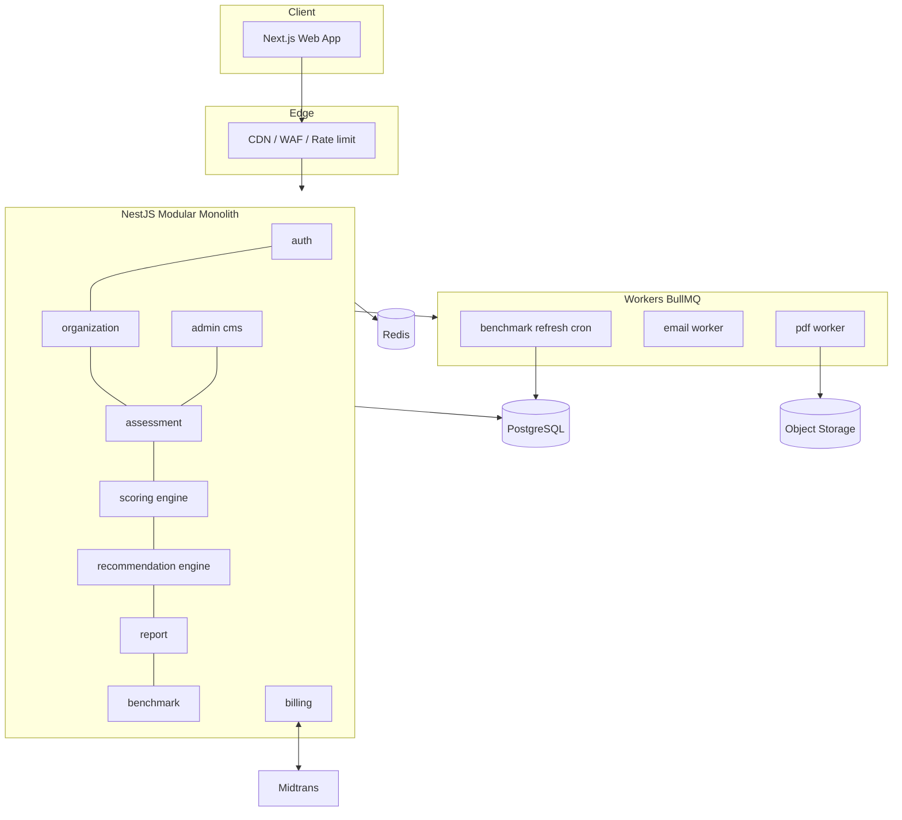
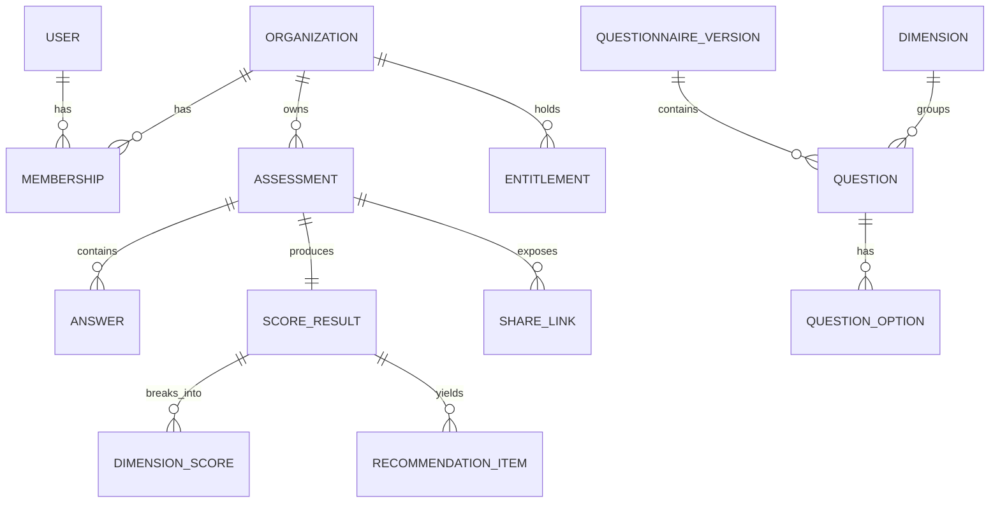

# TRD — Technical Requirements Document
**Produk:** SiapAI · **Versi:** 1.0 · **Tanggal:** 2026-09-12

---

## 1. Prinsip Arsitektur
1. **Deterministik & auditable** — skoring adalah fungsi murni, hasilnya di-snapshot; rubrik berversi.
2. **Konten sebagai data** — pertanyaan, bobot, aturan visibilitas, rekomendasi disimpan di DB, bukan hardcode.
3. **Kontrak dulu** — OpenAPI 3.1 adalah sumber kebenaran; tipe client & server digenerate darinya.
4. **Modular monolith** — satu deployable, batas modul tegas; siap dipecah bila perlu.
5. **Secure by default** — deny-all RBAC, tenant isolation wajib di setiap query.

## 2. Tumpukan Teknologi
| Lapisan | Pilihan | Alasan |
|---|---|---|
| Frontend | Next.js 15 (App Router), TypeScript, Tailwind, shadcn/ui, Recharts | SSR untuk SEO landing, form kompleks |
| State form | react-hook-form + zod | Validasi selaras dengan schema API |
| Backend | NestJS (Node 22, TypeScript) | Modular, DI, cocok modular monolith |
| DB | PostgreSQL 16 | Relasional + JSONB untuk snapshot |
| ORM | Prisma | Migrasi terkontrol |
| Cache/Queue | Redis + BullMQ | OTP, rate limit, job PDF & email |
| Object storage | S3-compatible (Cloudflare R2) | PDF & bukti |
| PDF | Playwright (render halaman hasil) | Konten identik HTML (PA3) |
| Auth | JWT access 15m + refresh rotatif 30d, Google OAuth2 | |
| Pembayaran | Midtrans Snap | Pasar Indonesia |
| Email | Resend / AWS SES | OTP, laporan |
| Observability | OpenTelemetry, Sentry, Grafana/Loki | |
| CI/CD | GitHub Actions → Docker → Fly.io/AWS ECS | |

## 3. Diagram Sistem


## 4. Model Data


Tabel inti (kolom kunci):
- `organizations(id, name, industry, employee_band, revenue_band, country, province, created_at)`
- `users(id, email, name, email_verified_at, created_at)`
- `memberships(user_id, organization_id, role, status)` — PK gabungan
- `questionnaire_versions(id, version, status[DRAFT|PUBLISHED|ARCHIVED], published_at)`
- `dimensions(code, name, weight, questionnaire_version_id)`
- `questions(id, code, dimension_code, type, prompt, help_text, weight, required, order, visibility_rule JSONB, questionnaire_version_id)`
- `question_options(id, question_id, code, label, score, order)`
- `assessments(id, organization_id, created_by, type[QUICK|FULL], status[IN_PROGRESS|SUBMITTED|SCORED|ARCHIVED], questionnaire_version_id, rubric_version, is_test, started_at, submitted_at, deleted_at)`
- `answers(id, assessment_id, question_code, value JSONB, evidence_url, answered_at)` — unique `(assessment_id, question_code)`
- `score_results(id, assessment_id, total_score, level, verdict, gates JSONB, confidence, breakdown JSONB, rubric_version, computed_at)`
- `dimension_scores(score_result_id, dimension_code, score, level, weight)`
- `recommendation_catalog(code, title, body, dimension_code, impact, effort, horizon, owner_role, cost_band, trigger_rule JSONB)`
- `recommendation_items(score_result_id, code, priority_score, rank)`
- `benchmarks(industry, employee_band, dimension_code, p25, p50, p75, sample_size, period)`
- `share_links(token_hash, assessment_id, expires_at, anonymize, revoked_at)`
- `entitlements(organization_id, plan, status, valid_until)`
- `audit_logs(id, actor_id, org_id, action, entity, entity_id, meta JSONB, ip, created_at)`

Indeks penting: `answers(assessment_id)`, `assessments(organization_id, status)`, `score_results(assessment_id)`, `benchmarks(industry, employee_band)`.

## 5. Mesin Skoring
- Paket terpisah `packages/scoring` tanpa dependensi I/O → mudah diuji.
- Antarmuka: `score(input: ScoringInput): ScoringOutput` di mana `ScoringInput = { answers, questionnaire, rubric }`.
- **Wajib**: property-based test bahwa fungsi deterministik dan monotonic (menaikkan satu jawaban tidak menurunkan skor dimensi).
- Snapshot hasil disimpan ke `score_results.breakdown` agar laporan lama tetap dapat direproduksi.

Aturan visibilitas (JSON DSL):
```json
{
  "all": [
    { "question": "ORG-02", "op": "in", "value": ["50_99", "100_499", "500_999", "1000_plus"] },
    { "any": [ { "question": "TEC-01", "op": "eq", "value": "cloud_hybrid" } ] }
  ]
}
```
Operator didukung: `eq, neq, in, nin, gt, gte, lt, lte, exists`. Evaluator murni, tanpa eval dinamis.

## 6. Keamanan
| Area | Kontrol |
|---|---|
| Transport | TLS 1.3 wajib, HSTS |
| At rest | Enkripsi disk DB, bucket privat, pre-signed URL |
| AuthZ | Guard NestJS per-route + filter `organization_id` di repository layer (tenant isolation ganda) |
| Rate limit | 100 req/menit/IP umum; 5 req/menit untuk OTP |
| Input | Validasi zod/class-validator, sanitasi teks, ukuran upload maks 10 MB, whitelist MIME |
| Secrets | Secret manager, tidak pernah di repo |
| Audit | Semua aksi mutasi tercatat di `audit_logs` |
| PDP (UU 27/2022) | Consent tercatat, hak akses/hapus data, retensi draft 30 hari, data residency Indonesia/Singapura |
| Dependency | `npm audit` + Dependabot di CI, gagal build pada high severity |

## 7. Kinerja & Skala
| Metode | Target |
|---|---|
| p95 GET pertanyaan | < 300 ms |
| p95 PATCH autosave | < 200 ms |
| Skoring sinkron | < 2 s |
| Generasi PDF | < 10 s (async, notifikasi) |
| Ketersediaan | 99.5% bulanan |
| Kapasitas awal | 500 assessment bersamaan, 50k baris jawaban/hari |

## 8. Pengujian
| Level | Cakupan | Alat |
|---|---|---|
| Unit | scoring, visibility DSL, recommendation rules (≥ 90% coverage paket scoring) | Vitest |
| Kontrak | Respons API divalidasi terhadap OpenAPI | Dredd / schemathesis |
| Integrasi | Repository + Postgres nyata | Testcontainers |
| E2E | Alur daftar → isi → submit → laporan → PDF | Playwright |
| Beban | 200 VU pada endpoint autosave | k6 |
| Aksesibilitas | WCAG 2.1 AA pada form | axe-core di CI |

## 9. Lingkungan & Rilis
`local` → `staging` (data sintetis) → `production`. Migrasi Prisma dijalankan otomatis dengan strategi expand-and-contract. Feature flag untuk F10/F14/F17. Rollback: image sebelumnya + migrasi backward-compatible.

## 10. Observability
- Trace terhubung dari klik submit sampai skoring (`trace_id` dikembalikan di error envelope).
- Metrik bisnis di-emit sebagai metrik: `assessment_submitted_total`, `dropoff_by_question`, `scoring_duration_seconds`.
- Alert: error rate > 2% 5 menit, p95 autosave > 500 ms, antrean PDF > 100.

## 11. Backup & DR
Backup Postgres PITR harian + WAL; uji restore bulanan. RPO 15 menit, RTO 4 jam.

## 12. Struktur Repo
```
audit/
  apps/web        Next.js
  apps/api        NestJS
  packages/scoring  mesin skoring murni
  packages/contracts  tipe hasil generate dari OpenAPI
  contracts/openapi.yaml
  docs/           BRD, PRD, FRD, TRD, DESIGN, QUESTION_BANK
  prisma/         schema & migrasi
```
